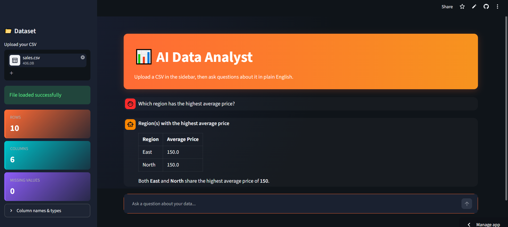
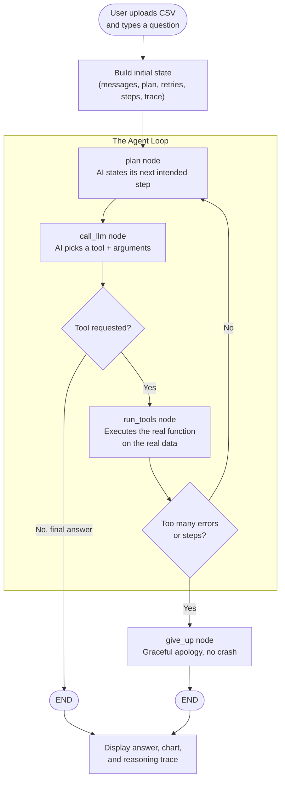

# 📊 AI Data Analyst

An AI agent that lets you upload a CSV file and ask questions about it in plain English — no formulas, no code, no fixed command syntax. The agent reasons about your question, decides which analysis to run, executes it on your real data, and explains the result back to you, with charts where relevant.

**🔗 Live demo:** https://ai-data-analyst-brl4ejl34qwe2eqpwtwhhw.streamlit.app/



---

## What it does

- Upload any CSV file
- Ask questions like *"which region has the highest average price?"* or *"are there any outliers in quantity?"* — in plain English, any phrasing
- The agent picks the right analysis tool (or chains several together for multi-step questions), runs it on your real data, and answers in plain English
- Generates charts (histograms, bar charts, scatter plots, etc.) inline when relevant
- Shows its full reasoning trace — you can see exactly which tools it called and why
- Export the full Q&A session as a downloadable Markdown summary

---

## Why this project exists

Most "ask your data" demos wrap a single prompt around an LLM and hope for the best. This project instead treats the LLM strictly as a **decision-maker and explainer**, never as a calculator — every number in every answer comes from real pandas code, not from the model's own arithmetic. The agent's control flow (deciding what to do, doing it, checking the result, deciding what to do next) is built as an explicit, inspectable graph using LangGraph, rather than a hidden black-box loop — so the reasoning is traceable, debuggable, and extensible.

---

## Architecture



The graph is built with LangGraph's `StateGraph` (Graph API) — a custom implementation, not the prebuilt `create_react_agent` shortcut — so that planning, tool selection, execution, and failure handling are each explicit, separately testable stages.

---

## Tools available to the agent

| Category | Tool | Purpose |
|---|---|---|
| Summary statistics | `describe_data` | Mean, min, max, std dev for numeric columns |
| | `correlation` | Relationship strength between two numeric columns |
| Filtering & ranking | `filter_data` | Narrow rows by a condition |
| | `sort_data` | Top/bottom N rows by a column |
| Category comparison | `group_by_agg` | Aggregate (mean/sum/count/etc.) grouped by category |
| | `value_counts` | Count occurrences of each category value |
| Data quality | `missing_data_check` | Detect null/missing values per column |
| | `detect_outliers` | Flag statistical outliers via the IQR method |
| Visualization | `plot_column` | Histogram, bar, box, line, or scatter charts |
| Autonomous analysis | `generate_insights` | Proactively surfaces notable patterns without being asked a specific question |

---

## Tech stack

- **Orchestration:** LangGraph (custom `StateGraph`, not a prebuilt agent)
- **LLM:** Groq (`openai/gpt-oss-120b`), swappable to Claude/GPT via a one-line change
- **Data processing:** pandas
- **Visualization:** Plotly
- **UI:** Streamlit, with custom CSS theming
- **Deployment:** Streamlit Community Cloud

---

## Running it locally

```bash
git clone https://github.com/ChinmayPatil14/Ai-data-analyst.git
cd Ai-data-analyst
python -m venv venv
venv\Scripts\activate        # Windows
# source venv/bin/activate   # Mac/Linux

pip install -r requirements.txt
```

Create a `.env` file in the project root:
```
GROQ_API_KEY=your_groq_api_key_here
```

Get a free API key at [console.groq.com](https://console.groq.com).

Run the app:
```bash
streamlit run app.py
```

---

## Design decisions & known limitations

**Grounding against hallucination.** Early testing surfaced a real failure: the agent once reported a "West" region that didn't exist anywhere in the dataset — it had been filling gaps with plausible-sounding but fabricated details rather than only reporting real tool output. This was fixed by explicitly instructing the model, via the system prompt, to state only facts returned directly by a tool call, and to call another tool rather than guess when unsure.

**Two independent stopping conditions.** Tool *errors* increment a retry counter (capped at 3), but a tool can also fail silently — succeeding without ever finding what was asked for. To prevent an infinite loop in that case, a separate hard cap on total steps (6) exists independently of the error counter, so the agent always terminates even when nothing technically "errors."

**Single global dataframe state.** The current implementation holds the active dataset in a shared in-memory variable rather than per-session storage, which is adequate for a single-user demo but would need per-session isolation for concurrent multi-user production use.

**Free-tier LLM trade-offs.** Groq's free tier occasionally produces malformed tool calls or rejects a request if it detects tool-call-shaped content in a context where tools aren't currently offered. The planning node catches these failures and falls back to a safe default rather than crashing.

**Future work:**
- Time-series trend analysis for datasets with date columns
- Statistical significance testing between groups (e.g. t-tests)
- Multi-file support for joining/comparing datasets
- Per-session state isolation for concurrent multi-user deployment

---

## Author

Built by [Chinmay Patil](https://github.com/ChinmayPatil14) as a resume/portfolio project exploring agentic AI systems with LangGraph.